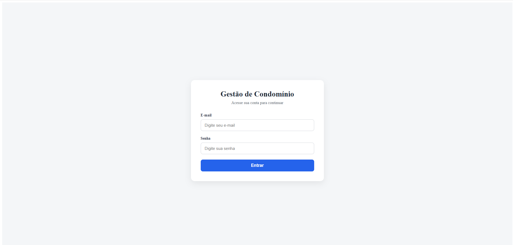
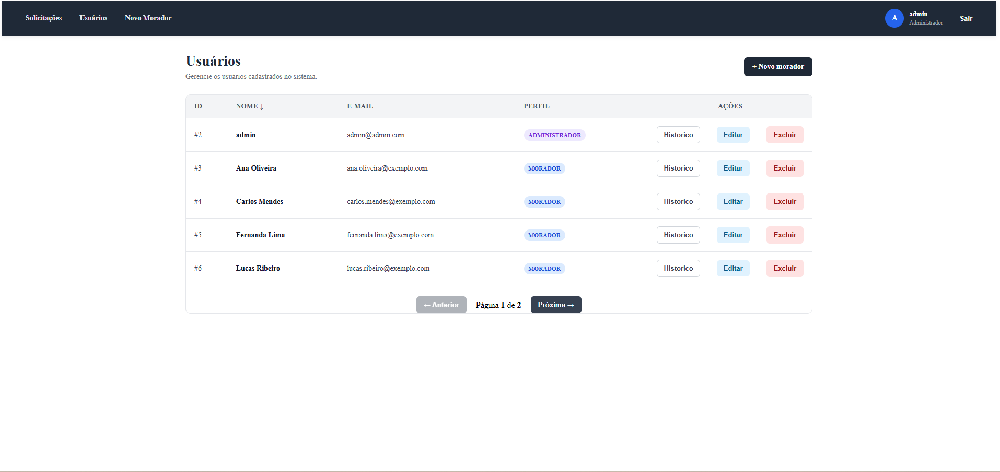
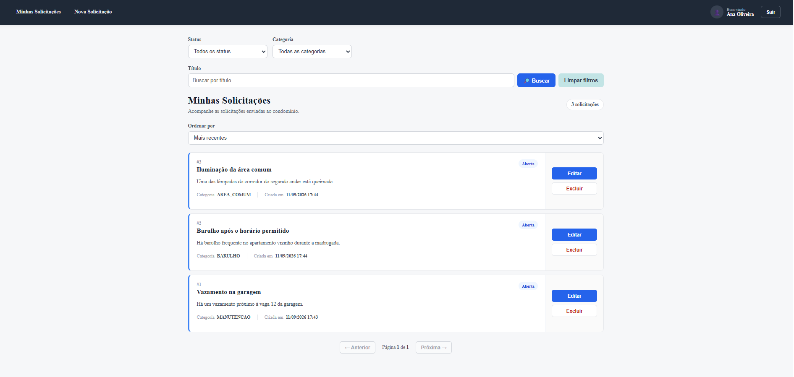
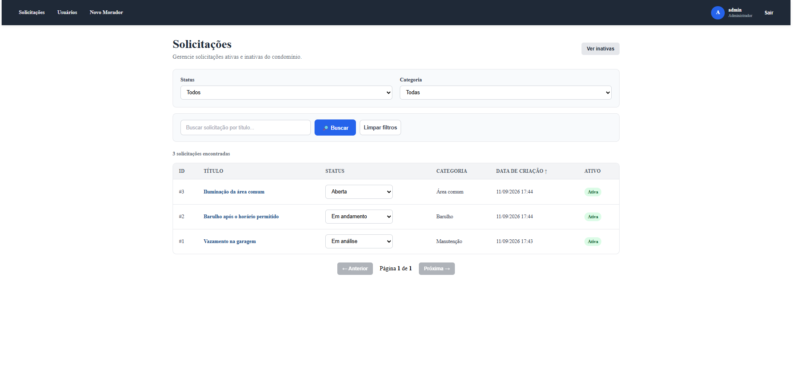

# Sistema de Gestão de Condomínio — Frontend

Interface web desenvolvida em Angular para o Sistema de Gestão de Condomínio.

A aplicação permite que moradores criem e acompanhem solicitações, enquanto administradores gerenciam usuários, solicitações, filtros, status e históricos.

## Demonstração

### Tela de login



### Gerenciamento de usuários



### Solicitações do morador



### Gerenciamento de solicitações




## Funcionalidades

### Morador

- Criar uma conta e realizar login
- Consultar e atualizar o próprio cadastro
- Criar solicitações
- Consultar as próprias solicitações
- Visualizar os detalhes de uma solicitação
- Filtrar solicitações por status, categoria e título
- Atualizar solicitações enquanto estiverem abertas
- Desativar solicitações próprias

### Administrador

- Consultar usuários cadastrados
- Consultar e filtrar solicitações
- Atualizar o status das solicitações
- Visualizar solicitações inativas
- Reativar solicitações
- Excluir permanentemente solicitações inativas
- Consultar o histórico dos moradores

## Tecnologias utilizadas

- Angular 19
- TypeScript
- Angular Router
- Reactive Forms
- HttpClient
- RxJS
- JWT Decode
- HTML
- CSS
- Nginx
- Docker

## Integração com o backend

O frontend consome uma API REST desenvolvida com Java e Spring Boot.

Para utilizar todas as funcionalidades, o backend deve estar disponível em:

```text
http://localhost:8080
```

O frontend envia o token JWT nas requisições protegidas e utiliza o perfil do usuário para controlar o acesso às páginas de morador e administrador.

Repositório do backend: [gestao-condominio-api](https://github.com/Emannuelcsr/gestao-condominio-api)

## Pré-requisitos

Para executar o projeto localmente, é necessário ter instalado:

- Node.js 18 ou superior
- npm
- Angular CLI 19
- Git

## Instalação

Na raiz do projeto, instale as dependências:

```powershell
npm install
```

## Executar em desenvolvimento

Inicie o servidor de desenvolvimento:

```powershell
npm start
```

A aplicação ficará disponível em:

```text
http://localhost:4200
```

Durante o desenvolvimento, as alterações feitas nos arquivos são recarregadas automaticamente.

## Gerar build de produção

Execute:

```powershell
npm run build
```

Os arquivos compilados serão gerados em:

```text
dist/gestao-condominio-front/browser
```

## Executar com Docker

Construa a imagem:

```powershell
docker build -t gestao-condominio-front:1.0 .
```

Inicie o container:

```powershell
docker run -d `
  --name gestao-condominio-front `
  -p 4200:80 `
  gestao-condominio-front:1.0
```

Acesse:

```text
http://localhost:4200
```

Para parar o container:

```powershell
docker stop gestao-condominio-front
```

Para remover o container depois de pará-lo:

```powershell
docker rm gestao-condominio-front
```

## Autenticação e autorização

A aplicação trabalha com dois perfis:

- `MORADOR`
- `ADMINISTRADOR`

Após o login, o token JWT é utilizado para autenticar as requisições enviadas ao backend.

As rotas e funcionalidades exibidas são controladas de acordo com o perfil autenticado.

## Tratamento da interface

A aplicação possui tratamento para:

- carregamento de dados;
- listas vazias;
- mensagens de erro da API;
- validação de formulários;
- filtros combinados;
- paginação;
- navegação entre lista e detalhes.

## Autor

**Emannuel Souza**

- [LinkedIn](https://www.linkedin.com/in/emannuel-souza-88132a208/)
- [GitHub](https://github.com/Emannuelcsr)